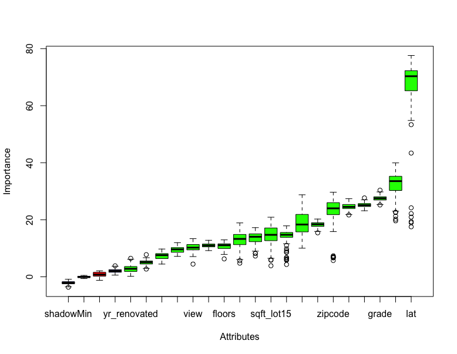

```{r setup, include=FALSE}
knitr::opts_chunk$set(echo = TRUE)

```

# Exploration

## Data Cleaning and Feature Engineering

### Construction of Feature Matrix

The training dataset has $10000$ cases, while the test dataset has $11613$ cases. Property, price, bathrooms, floors, lat, long are numerical variables, all other 15 varaibales are integers. There are no NA values. 

We might need to consider ways to make better use of some of the variables by changing their type or creating new features. 

Many of the integer variables (i.e. condition) in the dataset can be associated with a natural ordering (i.e., exellent, good, typical, fair, poor). It is advantageous to utilize this ordering, when using tree-based methods, since these methods are invariant to scale. When performing linear regression, these variables would be treated as categorical and indicators for each level will be used. 

Using the training data to inform our creation of features might result in features that are more useful in prediction. A Kaggle kernel by Tanner Carbonati (2017), which was discussed by other groups in class, provides a number of ideas for construction of such features. We have a dataset consisting entirely of numeric explanatory variables, which is helpful when using the XGBoost technique. We include both numerical variables constructed in this manner and indicator variables for each level of categorical variables in our dataset. 

Finally, we consider whether to include potential outliers that occur in the training data. In order to perform an honest cross validation, feature selection must be performed within each fold of a cross-validation. 


#### Cross-validation

To obtain a cross-validation error that "honestly" captures the performance of a predictor, all steps involved in producing a predictor must be applied to each cross-validation training set, including preprocessing (i.e., centering and scaling). The preprocessing functionality in the caret package is limited and cannot be applied to categorical variables. Consequently, we create custom models for elastic net regression, partial least squares, and random forest approaches. 


## Model Tuning

### Model 1: Elastic Net Regression

A tuning parameter, $\lambda$, controls the strength of the penalty. 

To be able to capture interactions and nonlinear relationships, we include two-way interactions between all variables in the feature matrix described previously, where categorical variables were converted to dummy variables, as well as quadratic terms for all numberical variables. Using the resulting feature matrix, we selected the two tuning parameters for the Ames housing data using 10-fold cross-validation repeated 10 times via the caret and glmnet packages. 

For fitting using log sale price as the response, the optimal values are 


### Model 2: Extreme Gradient Boosting (XGBoost)

Extreme Gradient Boosting (XGBoost) belongs to a family of boosting algorithms that convert weak learners into strong learners. As a sequential boosting process, XGBoost usually has more tunning parameters or "hyperparameters" than other machine learning algorithms. Each hyperparameter plays a significant role in the model's predictive performance. 


### Model 3: Partial Least Squares

We use PLS to regress log of house prince on a parameter space consisting of combinations of the columns of the original feature matrix. 

### Model 4: Random Forest

Random forest methodology is a nonlinear, tree-based approach that routinely handles interactions. We use cross-validation is used to set the number of predictor variables (m) considered for each split. 
 
## Model Ensembling and Stacking


##Feature Importance in Untuned Models

###Random Forest

\begin{table}[ht]
\centering
\begin{tabular}{rll}
  \hline
 & variable & importance \\ 
  \hline
1 & yr\_renovated &   0.4992177 \\ 
  2 & date &   0.9065502 \\ 
  3 & bedrooms &   6.0421826 \\ 
  4 & property &   6.4670191 \\ 
  5 & bathrooms &   6.5100015 \\ 
  6 & sqft\_basement &   7.0748873 \\ 
  7 & floors &   8.8741531 \\ 
  8 & view &  10.0188907 \\ 
  9 & condition &  10.9109650 \\ 
  10 & sqft\_lot &  18.2804637 \\ 
  11 & sqft\_above &  18.2991382 \\ 
  12 & sqft\_lot15 &  18.6771284 \\ 
  13 & waterfront &  23.0129720 \\ 
  14 & sqft\_living15 &  27.3023131 \\ 
  15 & yr\_built &  27.3150073 \\ 
  16 & sqft\_living &  29.0671704 \\ 
  17 & zipcode &  30.5908333 \\ 
  18 & grade &  33.2313801 \\ 
  19 & long &  47.6380478 \\ 
  20 & lat & 118.4975169 \\ 
   \hline
\end{tabular}
\end{table}

###Linear Model

Fit a linear model on price based on all other 20 variables in the train dataset. 

\begin{table}[ht]
\centering
\begin{tabular}{rll}
  \hline
 & variable & importance \\ 
  \hline
1 & property &  0.8204421 \\ 
  2 & sqft\_living15 &  1.5150501 \\ 
  3 & sqft\_lot &  1.8093173 \\ 
  4 & floors &  2.0701019 \\ 
  5 & sqft\_lot15 &  3.2589287 \\ 
  6 & yr\_renovated &  4.4502408 \\ 
  7 & sqft\_above &  5.1811499 \\ 
  8 & date &  5.5078135 \\ 
  9 & condition &  9.1731590 \\ 
  10 & bathrooms &  9.2501162 \\ 
  11 & long & 10.5256291 \\ 
  12 & zipcode & 11.9316841 \\ 
  13 & bedrooms & 12.9078782 \\ 
  14 & view & 15.8280646 \\ 
  15 & sqft\_living & 24.2314496 \\ 
  16 & waterfront & 24.4494812 \\ 
  17 & yr\_built & 24.6450373 \\ 
  18 & grade & 29.7758467 \\ 
  19 & lat & 37.9816361 \\ 
   \hline
\end{tabular}
\end{table}


###Boruta

A feature selection method using random forests (Kursa \& Rudnicki, J Stat Software, 2010)

\begin{table}[ht]
\centering
\begin{tabular}{rll}
  \hline
 & variable & decision \\ 
  \hline
1 & property & Confirmed \\ 
  2 & date & Rejected \\ 
  3 & bedrooms & Confirmed \\ 
  4 & bathrooms & Confirmed \\ 
  5 & sqrt\_living & Confirmed \\ 
  6 & sqrt\_lot & Confirmed \\ 
  7 & floors & Confirmed \\ 
  8 & waterfront & Confirmed \\ 
  9 & view & Confirmed \\ 
  10 & condition & Confirmed \\ 
  11 & grade & Confirmed \\ 
  12 & sqrt\_above & Confirmed \\ 
  13 & sqrt\_basement & Confirmed \\ 
  14 & yr\_built & Confirmed \\ 
  15 & yr\_renovated & Confirmed \\ 
  16 & zipcode & Confirmed \\ 
  17 & lat & Confirmed \\ 
  18 & long & Confirmed \\ 
  19 & sqrt\_living15 & Confirmed \\ 
  20 & sqrt\_lot15 & Confirmed \\ 
   \hline
\end{tabular}
\end{table}


The plot below shows the centered, scaled importance ranking for features not rejected by Boruta. 


